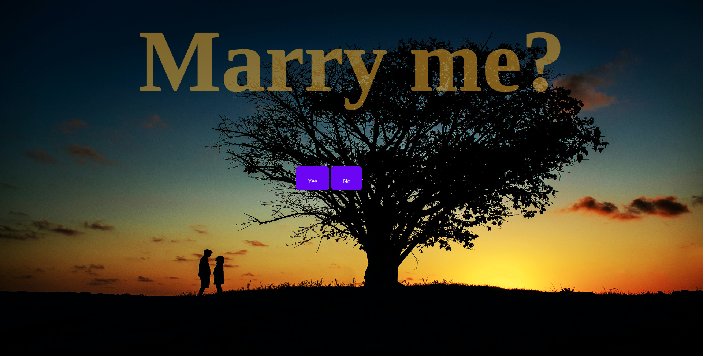

<h1 align="center">
     
</h1>

## 💻 Project
**Marry me?**: This project is a easy and intuitive way to get the expected YESSS from your love 😂
I made it to help a friend, I hope it can help you too 🥰

---
## 🛠️ Technologies

- [HTML](https://developer.mozilla.org/en-US/docs/Web/HTML)
- [CSS](https://developer.mozilla.org/en-US/docs/Web/CSS)
- [JAVASCRIPT](https://developer.mozilla.org/en-US/docs/Web/JavaScript)
---

## 🏁 Getting started ##

```bash

    #clone this project
    $ git clone git@github.com:Ca-byte/to-do-reactjs-ignite.git

    #folder access
    $ cd marryMe

    #run the project vsCode
    $ Alt + l Alt + o 
```
### localhost:
http://127.0.0.1:5500/

---

### Deployment:
https://marry-me-sepia.vercel.app/

---
## 📝 Licença
Esse projeto está sob a licença MIT. Veja o arquivo [LICENSE](LICENSE.md) para mais detalhes.

---

<p align="center">Desenvolvido com 💜 por Caroline Vieira</p>
